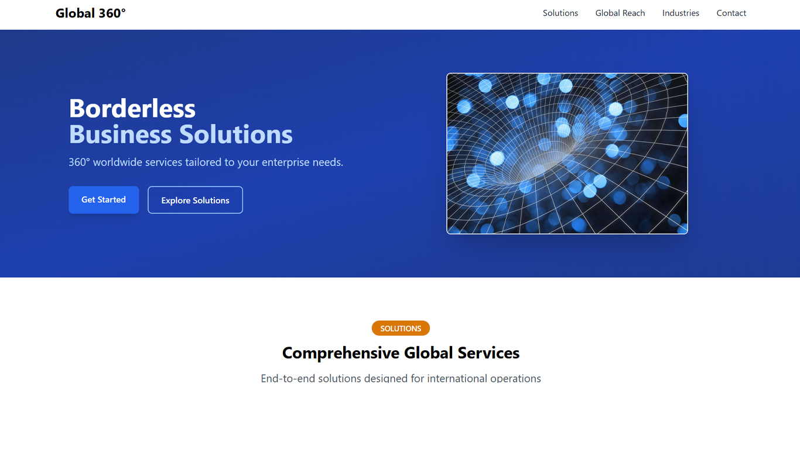

Global 360 Landing Page

Project Preview

A responsive landing page built with Tailwind CSS that demonstrates modern design principles including typography, color theory, and layout techniques.

Features
Design Principles Showcase:

Typography hierarchy with Inter font family

Color theory implementation (primary/secondary/accent colors)

Responsive layout patterns

Technical Highlights:

Built with Tailwind CSS utility classes

Mobile-first responsive design

Semantic HTML5 structure

Accessible components

Performance optimized assets

Design Principles Demonstrated
Typography
Font scaling with text-* classes

Line height adjustments (leading-*)

Font weight hierarchy

Responsive type sizes (mobile/desktop)

Color Theory
Primary/Secondary/Accent color scheme

Color contrast for accessibility

Gradients for visual interest

Hover/focus states

Layout
12-column grid system

Flexbox and Grid layouts

Responsive spacing (padding/margin-*)

Container queries for components

Breakpoint-specific designs

Installation
Clone the repository:

git clone https://github.com/yourusername/global-360-landing.git

Install dependencies:

This current setup works without npm – it’s just HTML/CSS/JS.

npm is optional unless you need:

- Tailwind customization

- Advanced optimizations

- A dev server with hot-reloading

In which case:
# Only run these if you need to modify Tailwind:
npm install -D tailwindcss postcss autoprefixer
npx tailwindcss init -p
npm run build  # Generates optimized CSS

Project Structure

global-360-landing/
├── index.html          # Main HTML file
├── styles/
│   └── main.css        # Custom CSS overrides
├── scripts/
│   ├── globe.js        # Interactive globe functionality
│   └── mobile-menu.js  # Mobile navigation
├── images/             # All project images
└── README.md           # This file

Credits
Font: Inter by Rasmus Andersson

Icons: Heroicons

Color Palette: Tailwind CSS defaults

License
MIT License - Free for personal and commercial use.

Customization
To modify the design:

Update colors in tailwind.config.js:

theme: {
  extend: {
    colors: {
      primary: '#2563EB',
      secondary: '#059669',
      accent: '#D97706'
    }
  }
}

Best Practices Implemented

✅ Semantic HTML5

✅ Mobile-first responsive design

✅ Accessible components (ARIA labels, focus states)

✅ Performance optimizations (preloading, image optimization)

✅ CSS utility class organization

✅ Consistent spacing system
